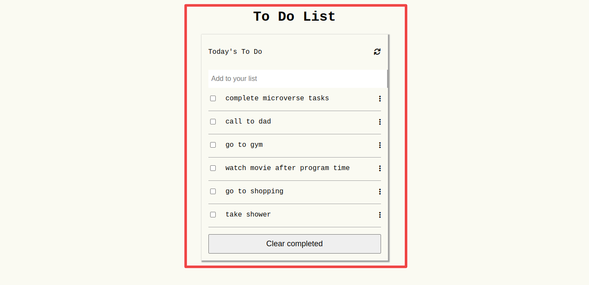

# To Do list: list structure

> In this project, I build a simple HTML list of To Do tasks. The list is styled according to the minimalist project. This simple web page is built using webpack and served by a webpack dev server.

## Built With

- `HTML` ,`CSS` and `JavaScript`
- Frameworks : `Webpack`
- Technologies used: `GitHub`

## Author

👤 **Zelalem Mekonnen**

- GitHub: [GitHub](https://github.com/zmekonnen251)
- Twitter: [Twitter](https://twitter.com/mek_zela)
- LinkedIn: [Zelalem G. Mekonnen](https://www.linkedin.com/in/zelalem-getachew/)

## Live Demo

[live Demo](https://zmekonnen251.github.io/to-do-list/dist/)

## 🤝 Contributing

Contributions, issues, and feature requests are welcome!

Feel free to check the [issues page](../../issues/).

## Show your support

Give a ⭐️ if you like this project!

## 📝 License

This project is [MIT](./MIT.md) licensed.
